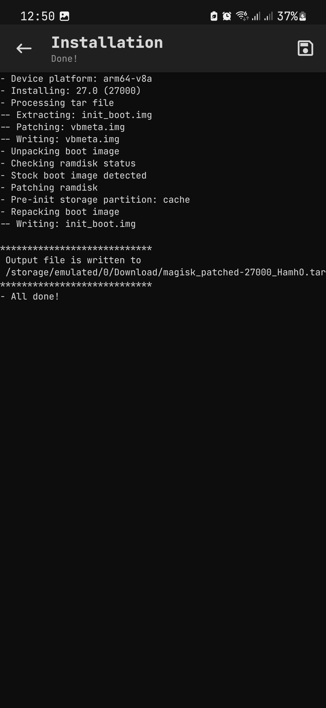

# Sort-of-kinda-universal-may-or-may-not-work rooting method for Samsung devices

##  When in doubt, consult [magisk docs](https://topjohnwu.github.io/Magisk/install.html)

## Check if rooting is possible at all

- Boot in Download mode (this may be device specific):
  * poweroff the phone
  * hold `volume up` + `volume down` then insert usb cable (connected to laptop)
    
  * press `volume up` to continue
  
- Check for `OEM LOCK`, possible values:
  * ON  (L):  fully locked
  * ON  (U):  locked, but unlocking is enabled
  * OFF (U):  fully unlocked

  If no value is shown, DO NOT PROCEED

- For phones with KnoxGuard, check for `KG STATUS`, possible values:
  * ACTIVE, LOCKED:  locked
  * PRENORMAL:  temporarily locked, reching 168h of uptime should trigger unlock
  * CHECKING, COMPLETED, BROKEN:  unlocked

  Locked KnoxGuard will prevent you from installing Magisk

  

## Install Odin

- You need windows (10)
- If installing on linux with Virtualbox, to avoid undetected device problem, use Virtualbox as `root` user:
   * `sudo Virtualbox`
   * install WM
- Install [Odin](https://dl2018.sammobile.com/Odin.zip)
- Install [Samsung USB drivers](https://developer.samsung.com/android-usb-driver)

1) Unlock bootloader

- Enable `Developer options`:
    `Settings` -> `About phone` -> `Software information` -> click `Build number` 10 times
- Allow bootloader unlocking in `Developer options` -> `OEM unlocking` (if the option is missing, try connecting to internet and synchronizing the clock)
- Reboot in Download mode
- Unlock Bootloader (long press `volume up`). This will wipe all data and reboot
- Go through initial settup, enable `Developer options`, connect to internet, and synchronize the clock
- Go to `Developer options` and check for `OEM unlocking`, switch should be disabled, but ON
  
  
2) Download firmware

- Go to [samfw](https://samfw.com)
- Enter your model code 
    `Settings` -> `About phone` -> `Software information` -> `Service provider software version`
    
- Enter `CSC`
    `Settings` -> `About phone` -> `Software information` -> `Service provider software version`
    
- Download

In the downloaded firmware you should find 5 crucial files named like this:
 `AP_*.tar.md5`
 `BL_*.tar.md5`
 `CP_*.tar.md5`
 `CSC_*.tar.md5`
 `HOME_*.tar.md5`

- OR, you could do the following:
  * Regardless of your `CSC`, just choose `INS` (India)
    Some features are blocked in some countries (like call recording), India has everything unlocked
  * Proceed to [Clean flash](#clean-flash)

3) Root
  - extract `init_boot.img.lz4` from `AP` (AP_*.tar.md5 is just a compressed file)
  - extract `vbmeta.img.lz4` from `BL`
  - put those two in a .tar:
    e.g.: `tar -cvf patch.tar init_boot.img.lz4 vbmeta.img.lz4`
  - transfer patch.tar to the phone
  - install the [latest version of Magisk](https://github.com/topjohnwu/Magisk/releases) on the phone
  - open Magisk
  - click `Install`
    
  - click `Select and Patch a File`
    
  - choose your `patch.tar`
  - click `LET'S GO ->`
  - transfer generated file back to laptop
    

  Do everything like in [Clean flash](#clean-flash), except for choosing files:

  ```
    AP  -> magisk generated file`
    BL  -> BL_*.tar.md5`
    CP  -> CP_*.tar.md5`
    CSC -> CSC_*.tar_md5`
  ```

  NOTE: In case this fails, try you can try booting into recovery mode, recovery wiping data, and flashing only AP file (magisk generated one). In this case, in Odin, disable `Auto Reboot` and after flashing the AP file, go into recovery mode first and wipe `/data`, and only then boot into system.

  Data should be wiped again, so install and open Magisk

  Magisk will promt you to do one last finishing step (just click `ok` or `yes`, or whatever pops in the prompt)

  After that the phone will reboot and you should be rooted

## Clean flash

In case you fuck something up, you can always flash a clean firmware:

- Open Odin (`right click` -> `Run as administrator`)
  
- Select files for:

  ```
    AP (this will take some time)
    BL
    CP
    CSC
  ```
  
- Boot phone to `Download mode`
- Odin should register the phone 
  
- Click `Start`
- Green `PASS` should appear upon successfull operation

Phone will auto reboot

## Play Integrity Fix

In order to use some functionalities (like enabling RCS chat), you will also need to apply [Play Integrity Fix](https://github.com/chiteroman/PlayIntegrityFix) Magisk module.

- Download `PlayIntegrityFix_vXX.Y.Z.zip` from [official releases page](https://github.com/chiteroman/PlayIntegrityFix/releases/).
- Transfer it, via `adb` to the phone.
- *Make sure* that `Zygisk` is enabled in Magisk.
- Open *modules* tab, and flash transferred zip file.
- Reboot device.

In order to check PI, use `Play Integrity API Checker` from [here](https://github.com/1nikolas/play-integrity-checker-app) or [here](https://play.google.com/store/apps/details?id=gr.nikolasspyr.integritycheck).

After requesting the attestation in `Play Integrity API`, you should get passing results on MEETS_BASIC_INTEGRITY and MEETS_DEVICE_INTEGRITY.

NOTE: In case you are looking for SafetyNet fix - [SafetyNet is obsolete](https://developer.android.com/privacy-and-security/safetynet/deprecation-timeline).
